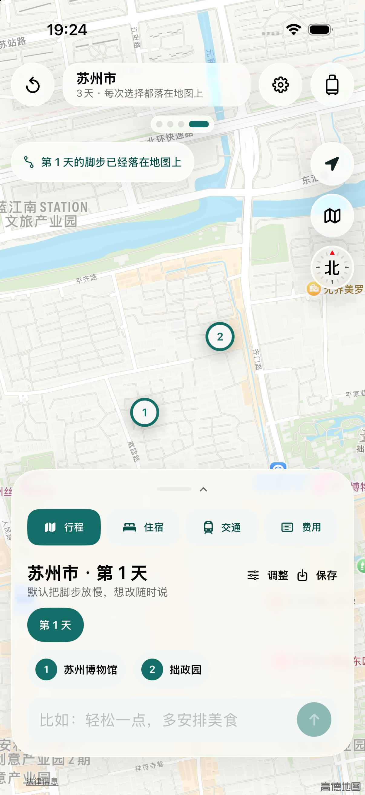
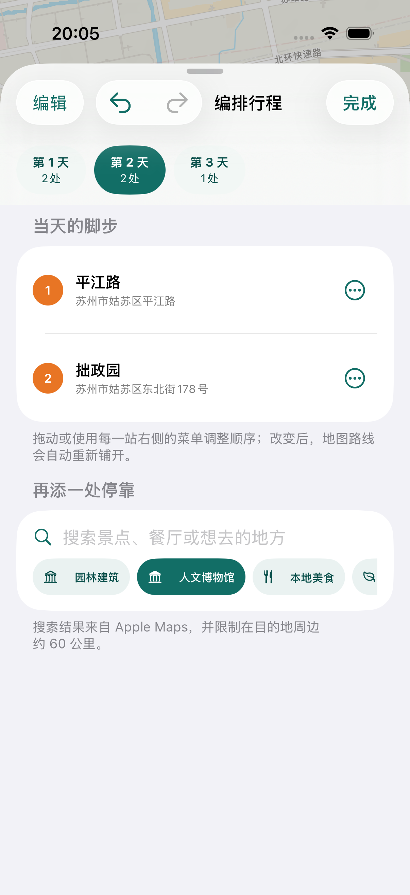
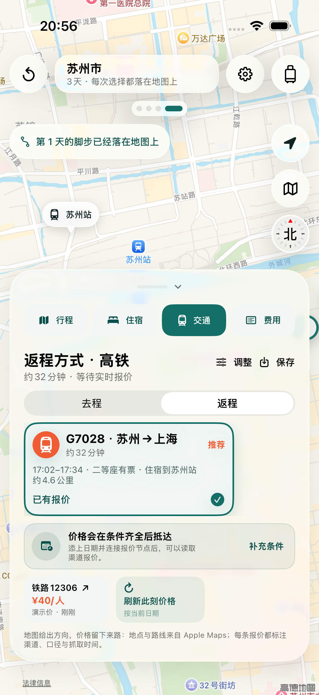
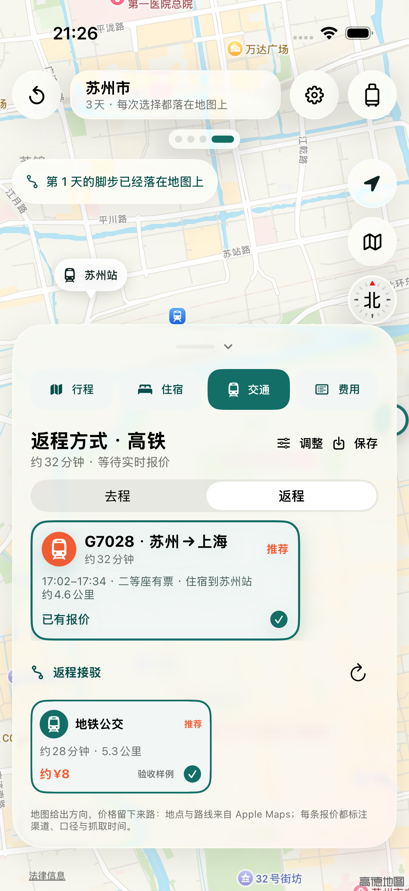
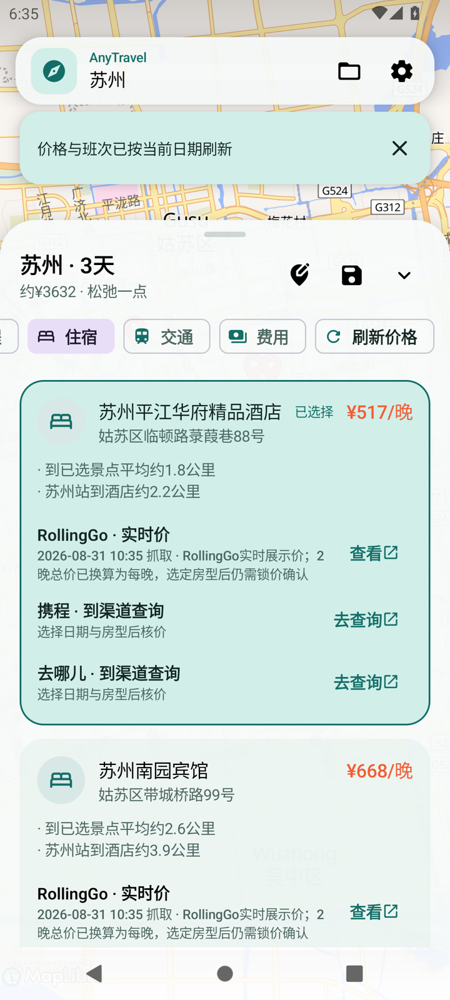

# AnyTravel

> 旅行是一场诗意的迁徙。AnyTravel 让每一次选择，都在地图上长成旅程。

AnyTravel 是一款地图优先的开源 iOS 与 Android 旅行规划应用。用户不必先填完一张长表格：可以先选车次，也可以先挑住处；可以从预算出发，也可以只说“我想去XX”。路线、住宿、抵达枢纽和每天的安排都会在背景地图上随选择更新。

<p align="center">
  
</p>











动效实录：[首次启动与初始化](Documentation/Demo/onboarding-motion.mp4) · [地图、住宿、交通与费用联动](Documentation/Demo/map-plan-motion.mp4)

下载：[iOS 0.8.1 无签名 IPA](https://github.com/Rseam-07/AnyTravel/releases/tag/v0.8.1) · [Android 0.8.1 通用 Release 预览 APK](https://github.com/Rseam-07/AnyTravel/releases/tag/v0.8.1)

Web 版（开发中）：位于 [Web/](Web/README.md)，React + TypeScript + MapLibre GL，桌面为 Apple Maps 式大屏横排（左面板 + 全屏地图 + 底部轨道），移动端为三档底部面板；`cd Web && npm install && npm run dev` 后访问 `http://127.0.0.1:5182`。已跑通：目的地/条件输入、141 个国内目的地离线攻略、OSM 景点与营业时间、空间聚类方案、OSRM 耗时、天气、住宿比价、12306 去返程、去哪儿门票、自然语言白名单动作、费用对比、旅册、分享链接与可安装 PWA 外壳。

<p align="center">
  
  
  
</p>

## 一段旅程如何展开

- 第一次打开应用时，先看四页简短介绍，再留下常用出发地、人数和预算。行程默认保持轻松节奏。
- iOS 可在应用内登录携程、去哪儿、飞猪、同程、Trip.com 和铁路 12306；Android 当前提供平台购买与登录页面入口。密码只提交给平台网页，AnyTravel 不读取或保存密码。
- 日期、预算、兴趣、住宿和交通没有固定填写顺序，每一项都可以暂时留白。
- `MKLocalSearch` 会寻找真实景点、酒店、民宿和交通枢纽；`MKDirections` 会逐段绘制当前日路线。
- 方案生成后仍可继续搜索 Apple Maps 地点、添加或删除停靠、拖动顺序、跨天移动或复制，并可撤销与重做；也能修改日期、出发地、人数、预算与交通偏好。地图路线和受影响的住宿、交通会重新计算。
- 当一段行程显得太赶，可以一键改成松弛节奏：保留全部地点，按空间关系重新铺开天数、时刻、路线、住宿晚数、返程和接驳。
- 首页是一块开放的自然语言输入区。用户可以随意写下出发地、目的地、日期、天数、人数、预算、节奏、兴趣、交通方式和住宿条件；默认由伴随服务托管 GLM-5.3-Flash，也可在设置中填写任意 OpenAI 兼容服务。模型动作必须通过本机白名单才会落到地图上，服务不可用时本机解析器会保留可确定的修改。
- 选定住处后，交通建议会结合抵达时间、车站或机场到住处的距离、总耗时和票价重新排列；铁路去程与返程分别查询、选择和计入费用。
- 每一段大交通还会继续接到门前：分别比较车站或机场与住处之间的地铁公交、打车和步行，选择后地图切换到对应接驳线，费用表单列往返接驳。
- 最终方案包含每天的具体时段、地点介绍、路线、住宿候选、交通方式、购买入口和费用明细。
- 每天不再只按数量平分景点：相近地点先聚成同一天，餐饮和夜游按时段落位，时间表显式写出移动、午餐、休息、营业时间与机动余量；去程晚到或返程较早时还会扣除接驳和提前进站时间。
- 完整方案可以折成多页 PDF，也可以把每天的安排写成可导入系统日历的 `.ics`；iOS 与 Android 都会通过系统分享页交付文件。
- 用户拖动地图时，自动镜头立即让出控制；点击卡片、车站或酒店时，地图再把相应位置带回视野。
- 欢迎页、路线展开、地图标记、标签滑块、卡片选择和报价刷新使用同一套可中断弹簧动效；系统开启“减少动态效果”后会自动改用淡入淡出或静态反馈。

## 当前数据能力

| 内容 | 当前实现 | 结果如何展示 |
| --- | --- | --- |
| 地点与市内路线 | Web、iOS、Android 共用覆盖 162 个目的地（含 141 个国内目的地）、1,234 个地点和 867 个来源的内置资料；iOS 以 Apple MapKit 为主，并可由高德补充，Android 再以系统 Geocoder 扩展 | 公开热度、空间分布、兴趣与文化和旅游部 5A 名录校验共同参与排序；用户先选的地点获得更长停留；Android 优先从 Valhalla 取得道路几何，失败时才把直连线明确标为示意 |
| 酒店与民宿位置 | iOS 并行搜索多类住宿，Android 使用目的地目录与 RollingGo 返回目录；两端都会合并 RollingGo 城市及景点锚点结果并去重 | 地图卡片显示品牌、星级、设施、标签、景点均距、交通枢纽距离与多渠道报价；两端支持低价、距离与实时价筛选 |
| 酒店实时价格 | 两端优先支持 RollingGo MCP（节点或 App 内置密钥），并直连雅高集团官网的公开选日房价；希尔顿官网公开城市目录补充品牌酒店与官网入口；伴随服务另支持携程与同程/艺龙登录会话、艺龙开放平台和万邦携程目录 | 渠道、每晚/总价口径、房型/床型/早餐/取消政策、抓取时间、缓存过期、部分成功、登录/验证状态、品牌官网与购买入口；同一物业跨渠道合并，分店不会误并 |
| 景点门票 | iOS 伴随服务读取去哪儿门票公开列表，并按景点名称严格匹配 | 地点卡、时间轴与费用表显示当前公开起价、抓取时间和购买页；计划日期、票种、优惠与库存仍需在平台复核 |
| 铁路班次与票价 | iOS 与 Android 均可直连铁路 12306 公开查询页，按抵达日与返程日分别只读查询；节点结果可继续合并去重 | 去程/返程独立车次、发到时间、余票、席别价格与官方购票页；单边失败不遮住另一边，真实班次会替换预算占位 |
| 门到门接驳 | iOS 使用 Apple MapKit 分别查询去程枢纽→住宿、住宿→返程枢纽的公交、驾车和步行 | 地图路线、耗时、距离、估算费用与推荐理由；地图缺少公交路线时明确标成“距离估算” |
| 方案导出 | iOS 与 Android 原生生成多页 PDF 与标准 iCalendar 文件 | 日程、住处、往返交通、接驳和费用完整落款；无日期仍可导出 PDF，日历会明确要求先补日期 |
| 其他住宿渠道 | iOS 支持去哪儿、同程与 Trip.com 应用内登录及会话复用；同程/艺龙浏览器适配器已落地；Android 提供购买页入口 | 同程只有在强匹配且得到数字价格时才标实时；去哪儿酒店与 Trip.com 未接通时明确显示“到渠道查询” |
| 航班 | iOS 与 Android 默认直连飞猪公开 H5 搜索，按日读取具体航班与起价；iOS 在用户明确保存去哪儿会话后可叠加去哪儿移动页，节点另有携程会话通道 | 去程/返程独立，展示航司、航班号、机场、时刻、耗时与当前起价；同一航班合并多渠道报价，真实航班会替换预算占位 |
| 智能向导 | 伴随服务托管 GLM-5.3-Flash；App 内置 `ANYTRAVEL_ZAI_API_KEY` 时可由应用直连接口；iOS 也支持用户自定义 OpenAI 兼容 Base URL、模型与 Key | 回应以卡片浮在地图上；可设置目的地/出发地、日期/天数、人数、预算、节奏、交通、兴趣与住宿筛选，也可直接生成或聚焦已有地点；失败时回退本机解析 |

行程编排的模型、假设与边界见 [行程规划模型](Documentation/ITINERARY_PLANNING_MODEL.md)，各适配器的状态见 [数据渠道说明](Documentation/DATA_CHANNELS.md)，本轮参考项目见 [开源调研记录](Documentation/OPEN_SOURCE_RESEARCH.md)，圆周旅迹的静态功能对照见 [参考审计](Documentation/CIRCLE_TRIP_REFERENCE_AUDIT.md)。PDF 与日历的降级规则见 [方案导出说明](Documentation/EXPORT_FORMATS.md)。铁路购票链接始终指向 [铁路 12306 官方页面](https://www.12306.cn/mormhweb/zxdt/202412/t20241211_43192.html)。RollingGo 接入参考其[官方开源仓库](https://github.com/RollingGo-AI/rollinggo-hotel-skill-cn)。

## 运行 iOS 应用

要求：iOS 17 或更新版本，建议使用 Xcode 26 或更新版本；当前发布验证工具链为 Xcode 27.0 beta、Swift 6.4 和 iOS 26.5 模拟器。工程使用 SwiftUI、MapKit、Observation、WebKit 和 Swift 6，不含第三方 App 运行时依赖。

```sh
xcodegen generate --spec project.yml
open AnyTravel.xcodeproj
```

选择 `AnyTravel` scheme 后即可运行。`project.yml` 是工程定义的源文件；提交前请重新生成一次 Xcode 工程。

调试启动参数：

- `--force-onboarding`：每次展示首次启动流程。
- `--skip-onboarding`：直接进入空白地图规划页。
- `--ui-test-ready`：载入带明确“演示价”标识的苏州完整方案，只用于界面验收。
- `--force-onboarding --motion-showcase`：在 Debug 中自动播放首次启动动效。
- `--ui-test-ready --motion-showcase-ready`：在 Debug 中自动播放地图方案标签与镜头联动。

## 运行 Android 应用

要求：JDK 17、Android SDK Platform 37.0 与 Build Tools 37.0.0；最低运行系统 Android 12（API 31）。

```sh
cd Android
./gradlew testDebugUnitTest lintDebug assembleRelease
```

GitHub 发布页提供 `app-universal-release.apk` 的重命名副本；它使用 Release 编译设置和公开预览签名。连接 Android 12 或更新版本的设备后，可运行 `./gradlew connectedDebugAndroidTest`。更多数据、性能降级与签名边界见 [Android 说明](Android/README.md)。

## 运行开源报价节点

```sh
cd Backend
npm install
npx playwright install chromium
cp .env.example .env
set -a; source .env; set +a
npm start
```

随后在 App 的“旅途偏好与价格渠道”中填写节点地址。模拟器可用 `http://127.0.0.1:8787/`；真机需使用同一局域网内电脑的 IP。携程采集前运行 `npm run login:ctrip`，同程采集前运行 `npm run login:tongcheng`，都由用户在弹出的浏览器里完成登录或验证。托管智能向导需要在 `.env` 配置 `ZAI_API_KEY`；高德补充搜索需要平台类型为“Web 服务”的 `AMAP_API_KEY`。完整请求示例见 [Backend/README.md](Backend/README.md)。

## 验证

```sh
# iOS 单元测试与 UI 流程
xcodebuild \
  -project AnyTravel.xcodeproj \
  -scheme AnyTravel \
  -destination 'platform=iOS Simulator,name=iPhone 17 Pro' \
  -derivedDataPath /tmp/AnyTravelDerived \
  CODE_SIGNING_ALLOWED=NO \
  test

# 报价节点解析测试
cd Backend && npm test
```

0.8.1 验证结果：iOS 常规单元套件执行 81 项，其中 3 项联网用例按设计跳过，其余 78 项通过；2 项价格首屏联网 XCUITest 均实际显示当前数字价格，覆盖酒店、航班和铁路。Android 常规单元套件执行 16 项，其中 2 项联网用例按设计跳过，其余 14 项通过；lint、Debug 与 Release 通用 APK 构建通过，单独启用的价格聚合联网测试取得酒店、航班和铁路数字结果。Backend 53/53、Web 7/7、生产构建和国内目的地知识库校验通过。当前构建机没有 Android 设备或 emulator/system image，因此没有把 Xperia 1 II 或 connected Compose 验收写成已通过。发布与真机边界见 [接力交接](Documentation/HANDOFF.md)。

0.6.3 发布前验证结果：57/57 iOS 单元测试、16/16 XCUITest、29/29 Node 测试通过。iPhone 17 Pro / iOS 26.5 模拟器覆盖 Apple 地图式三档面板拖拽、最小档自然语言输入、最大档内容浏览、人数和往返日期双向调整、自动规划地点去重，以及重置、设置、旅册、定位、地图样式和北向按钮的真实点击闭环；浅色偏好页和浅色/深色完整方案均完成截图检查。设备 Release 构建产物为 0.6.3（12）。所有服务端密钥只保存在被 Git 忽略的节点环境文件中。

0.4.0 Android 发布前验证结果：4/4 规划逻辑单元测试、1/1 Android 12 Compose 端到端流程和 lint 通过。APK 在 API 31 arm64 模拟器完成安装与视觉检查，并实际连接同一报价节点，显示 RollingGo 酒店实时价和铁路 12306 班次、票价、余票、接驳距离与抓取时间。APK 为调试签名预览包，尚未替代生产签名和真机矩阵。

## 隐私与边界

- 行程、默认偏好和平台会话保存在用户自己的设备；应用不读取平台密码。
- iOS 只有在对应平台网页留下有效 Cookie 后才会显示“会话已保存”；Cookie 失效后会自动撤销该状态。
- 自建报价节点的密钥和浏览器 Cookie 保留在运行节点的机器上，`.env` 与 `.data` 均不会提交；若通过 `ANYTRAVEL_ROLLINGGO_API_KEY`、`ANYTRAVEL_AMAP_WEB_SERVICE_KEY` 或 `ANYTRAVEL_ZAI_API_KEY` 注入内置密钥，它们只存在于构建/运行环境，不发生 Git 提交，界面也不会回显明文。
- 默认智能向导的模型 Key 只在伴随服务端使用；应用内置 Key 与用户自定义 Key 一样不会回显明文。
- 价格会标注渠道、口径和抓取时间；最终房型、税费、退改、余票和订单以平台结算页为准。
- 本项目只读分析了用户提供的 FocusFlight 与圆周旅迹 IPA，用于理解地图优先交互和功能范围；没有复制或重新分发其代码与资源。详见 [地图交互参考审计](Documentation/REFERENCE_AUDIT.md)与[圆周旅迹功能审计](Documentation/CIRCLE_TRIP_REFERENCE_AUDIT.md)。

## 开源许可

AnyTravel 采用 [MIT License](LICENSE)。原创“折叠远方”图标的来源与缩放检查记录见 [视觉资产清单](Documentation/Brand/ASSET_MANIFEST.md)。
